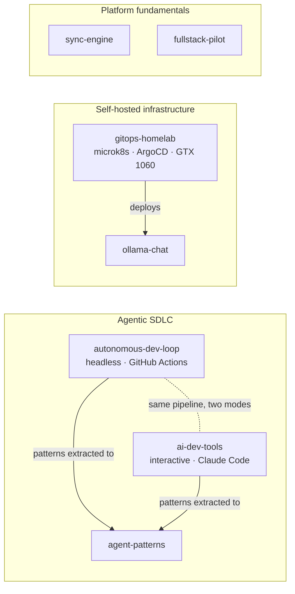

## Stéphane Hamel

Platform engineer. I build agentic SDLC pipelines and the infrastructure they run on.

**Thesis — bounded autonomy.** Let agents do the work, but enforce in code what a prompt can only ask, ground every verdict in executed evidence, and keep a human at the irreversible step. Every repo below is that idea under a different constraint.

### Agentic SDLC

| | |
|---|---|
| [`autonomous-dev-loop`](https://github.com/koydas/autonomous-dev-loop) | Issue → AI PR → evidence-backed AI review → auto-fix → human merge, on GitHub Actions. Built after an agent replaced a 26-test suite with an 18-line stub; 11 of its own features were shipped by the loop. 800+ tests, 25 ADRs. |
| [`ai-dev-tools`](https://github.com/koydas/ai-dev-tools) | The interactive counterpart in Claude Code: typed builders, an adversarial challenger, and a reviewer that runs your tests before it calls a patch done. |
| [`agent-patterns`](https://github.com/koydas/agent-patterns) | 15 multi-agent patterns indexed by the problem they solve — diagrams, trade-offs, failure modes, runnable code. 12 extracted from the two repos above. |

### Infrastructure

| | |
|---|---|
| [`gitops-homelab`](https://github.com/koydas/gitops-homelab) | Chat, code, vision, speech-to-text and text-to-speech models on one 6 GB GTX 1060 — bare-metal microk8s, ArgoCD, GPU time-slicing. 25 ADRs, 13 incidents written up with root cause. |
| [`ollama-chat`](https://github.com/koydas/ollama-chat) | Self-hosted chat UI for local LLMs, deployed by the repo above. |

### Platform fundamentals

| | |
|---|---|
| [`sync-engine`](https://github.com/koydas/sync-engine) | Webhooks drop events, polling is late: a Python sync engine built around 11 integration failure modes, each mapped to an ADR and a test. |
| [`fullstack-pilot`](https://github.com/koydas/fullstack-pilot) | Node, Python and .NET on MongoDB, PostgreSQL and SQL Server — with CI that tests database image upgrades against existing data. |

### How I work

- **Decisions in writing.** 65+ ADRs across these repos, each with rejected alternatives and consequences.
- **Incidents, not hypotheticals.** Guardrails and config trace back to a specific failure: a deleted test suite, a CUDA OOM, a Helm setting that never reached the pod.
- **Measure, then decide.** Quantization chosen by benchmark and by executing the generated code, not by reputation.
- **Honest scope.** What's enforced in code and what's only asked of a model are documented separately.

### Current focus

- Moving LLM guardrails from prompts into deterministic checks — import allowlists and type-check gates before a PR opens ([ADR-0019](https://github.com/koydas/autonomous-dev-loop/blob/main/docs/adr/0019-static-verification-backstop.md), proposed).
- Evaluating local models on constrained hardware by running what they produce ([ADR-0011](https://github.com/koydas/gitops-homelab/blob/main/docs/adr/0011-ollama-q4-quantization.md)).

`Node.js` · `.NET` · `Python` · `Kubernetes` · `ArgoCD` · `GitHub Actions` · `Claude API` · `Ollama`
